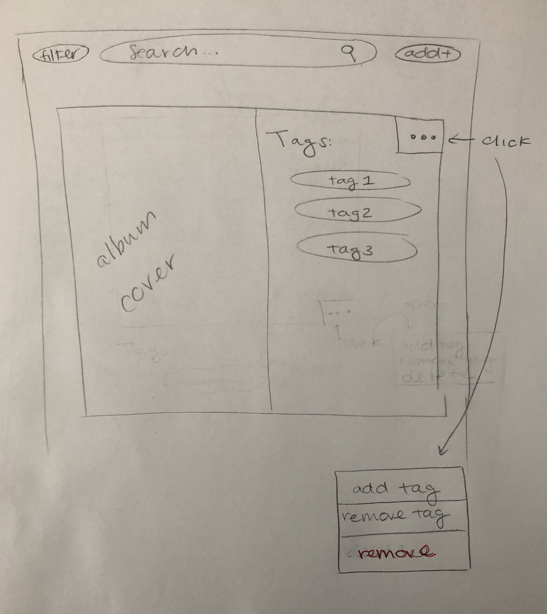
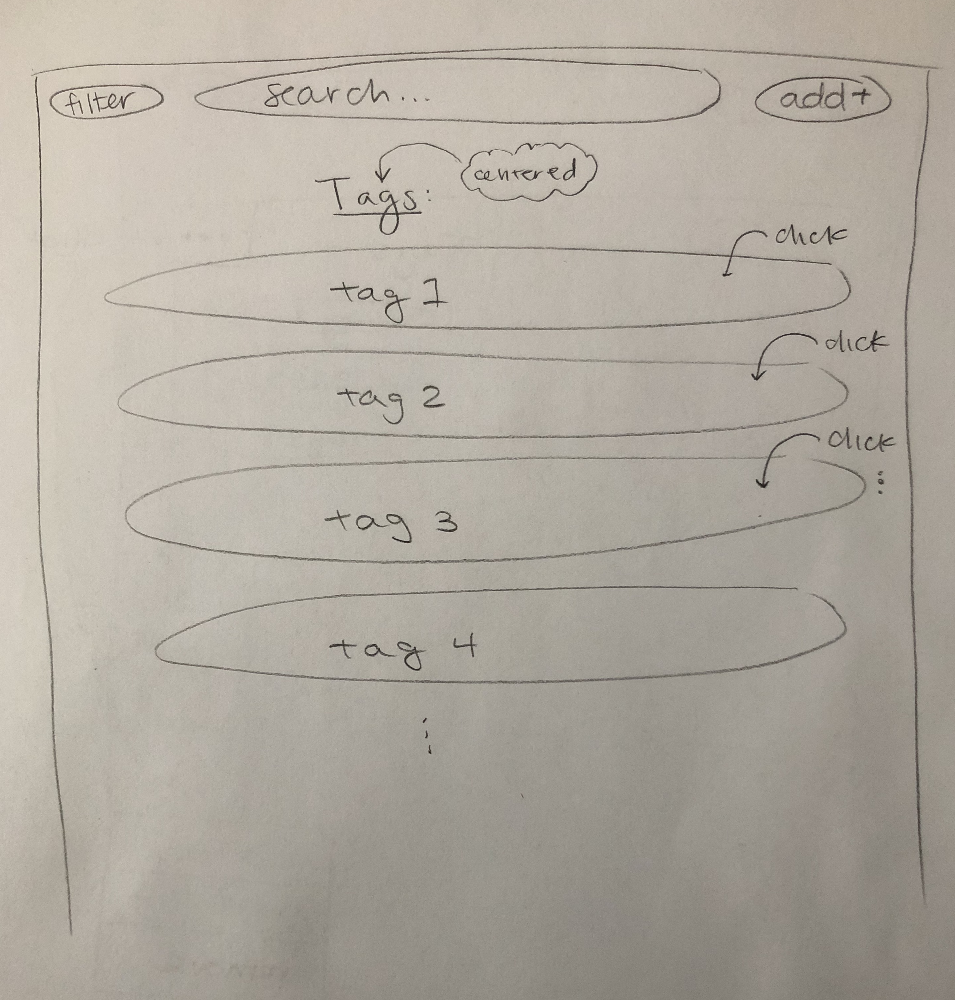
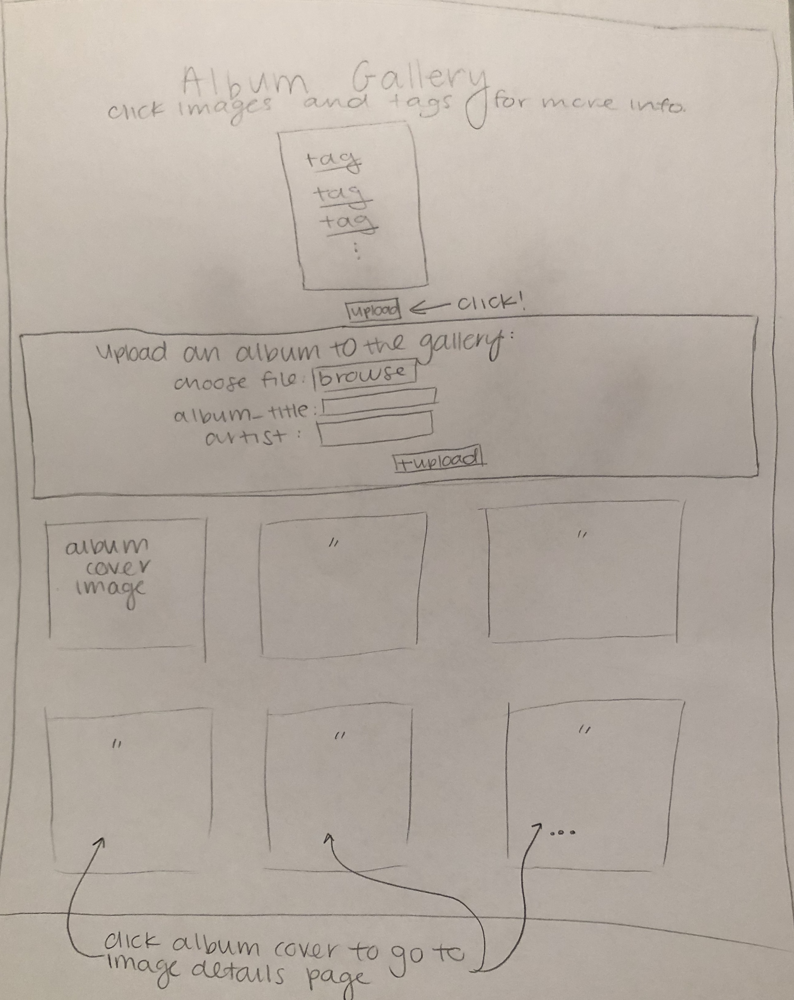
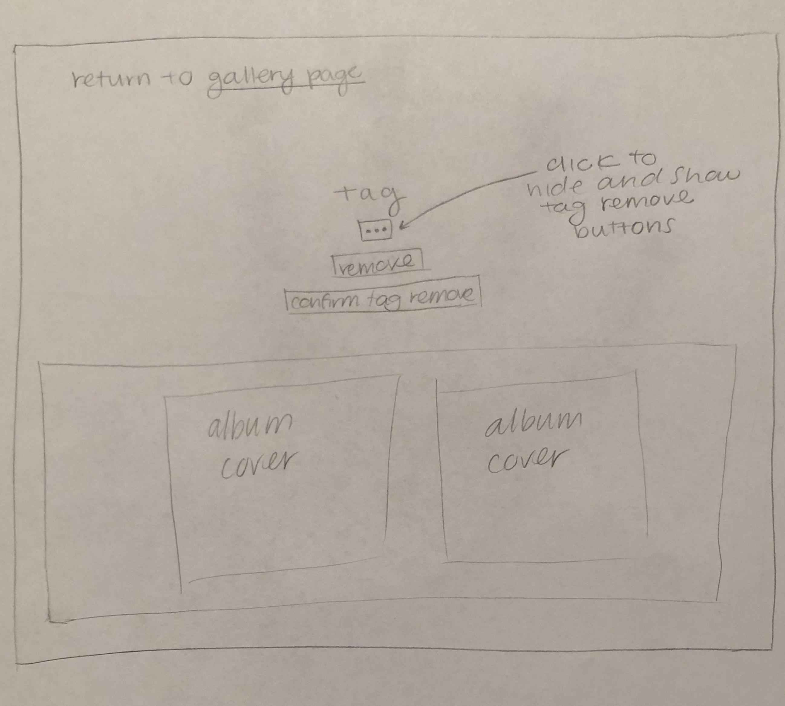

# Album Gallery Design Process

## Describe of the gallery

The gallery will be about music, it will be a gallery of album covers.

## Target Audience

The target audience for this site is people who are interested in music and album covers.  People who are looking for new music to listen to, or who want to recommend their favorite albums to others and comment on them with tags.

## Design Process

### Initial Gallery Page Sketches:


Single image initial sketch:



Tag page initial sketch:



### Final Gallery Page Sketches:

Gallery / Home Page Final Sketch:


Image Details Page Final Sketch:


Tag Details Page Final Sketch:


I have chosen to organize the content as shown in the sketches because it makes all of the information very clear and easy for the target audience to find.  Clicking on the images and tags to get to the details about that image or tag is a very simple and effective way for the target audience and users to be able to locate all of the information on the site, and quickly locate what specifically they are looking for.  Additionally, including the link back to the gallery page from both the image details page and the tag details page is a clear way to navigate between all the pages of the site quickly and without depending on the back and forward button.

## Leveraging Existing Design Patterns Throughout the Image Gallery

### Single Image View:
- One existing pattern is to have the image below and to the left of it.  My site will follow this pattern by when a single album cover is displayed, the image will be on the left with the tags below it

- A "..." menu button in the corner of an image is single image view is a common design pattern where you click the button to access more functionalities
  - My site has this "..." button on the corner of the image to open up the options for either adding a tag to the image, or deleting the image.
  - This same style "..." button is also incorporated on the tag details page in a similar way

- Deleting an album cover from the collection is an option when clicking the "..." next to the image.  Additionally, a common design pattern / practice is to have the initial delete button, followed by another confirmation that the user really wants to delete either the image or tag in reference.
  - I have leveraged this design pattern in both the image details and tag details page where there is a delete button that initially appears after clicking the ... button, however after this a secondary confirmation button appears that must be clicked as well.

### Gallery view:
- One convention of image galleries is that clicking on the image leads to more information.  My site is consistent with that pattern.
- Having all of the images appear in a grid format is an existing design pattern for image galleries as the most user friendly means of viewing all of the images

- A common design pattern is having left facing arrow in the top left corner when on a details page as a way to return to the main gallery page
  - I have leveraged this design pattern on my site where on both the image details page and the tag details page there is a left pointing arrow at the top (next to word instructions) where clicking links back to the gallery page.


## Planning Requests, Type of Request and Required Parameters

### Upload Image:
- Request: add an image to gallery
  - Type: POST
  - Initiate: form
  - Params: id, album_id

### Delete Image:
- Request: delete image
  - Type: POST
  - Initiate: form
  - Params: id, album_id

### Image Details:
- Request: view image details
  - Type: GET
  - Initiate: query string param URL
  - Params: id, album_id

### Tag details:
- Request: View tag and associated image
  - Type: GET
  - Initiate: query string param URL
  - Params: id, tag_id

### Remove Tag:
- Request: remove tag from its associated images
  - Type: POST
  - Initiate: Form
  - Params: id, tag_id, album_id


## Database Schema Design

### Plan:
```
albums (
  id: INTEGER {PK, U, Not, AI}
  file_name: TEXT
  file_ext: TEXT
  album_title: TEXT
)

tags (
  id: INTEGER {PK, U, Not, AI}
  tag: TEXT {U}
)

album_tags (
  id: INTEGER {PK, U, Not, AI}
  album_id: INTEGER
  tag_id: INTEGER
)
```


## Pseudocode Planning of Database Queries

### Display All Albums (gallery view):
```
SELECT * FROM albums
```

### Search albums:
```
SELECT * FROM albums WHERE album_title LIKE search
```

### Add albums:
```
INSERT INTO albums (file_name, file_ext, album_title) VALUES (file name, file extension, album title)
```

### Add Tags:
```
INSERT INTO tags (tag) VALUES (tag)
```

### Delete albums:
```
DELETE FROM albums WHERE album_title = "delete_input"
```

### Delete tags:
```
DELETE FROM tags WHERE tag = "delete_input"
```

### Display all tags:
```
SELECT * FROM tags
```

### Display all tags from specific album:
```
SELECT tags.tag FROM tags INNER JOIN album_tags ON album_tags.tag_id = tags.id INNER JOIN albums ON album_tags.album_id = albums.id WHERE albums.album_title = 'specfic album_title"
```

### Display all albums for a specific tag:
```
SELECT * FROM albums INNER JOIN album_tags ON album_tags.album_id = albums.id INNER JOIN tags ON album_tags.tag_id = tags.id WHERE tags.tag = 'specific tag'
```


## PHP Pseudocode Planning

### Upload file:
```
if (submit post request sent) {

filter inputs

if (no upload error) {
  if(small enough file) {
    get current file name and extension
  } else
  message
} else
message

insert new file into db

change file name and path to be in upload / albums folder
```

### all tags:
```
select all tags from table in db
if(at least one tag) {
  foreach (tag) {
    create an array with the id value of each tag

    echo tag as query string param url
  }
}
```

### all images:
```
select all images and info from table in db

if(at least one album) {
  foreach (album) {
    create an array with the id value of each album

    echo album as query string param url
  }
}
```

### add tag to album:
```
if (submit post request sent) {
  valid form true

  get image id

  filter inputs

  if (new tag and existing tag field both empty) {
    valid form false
  }

  if (valid form) {
    if (new tag)
    add tag to db
    add connection between tag and image to db
  } elseif (existing tag) {
    add connection between tag and image to db
  } else
  message

}
```

### delete album:
```
if(submit post request sent) {
  get image id

  delete album from albums table in db

  delete the image file

  delete the connection between album and any tags

  push message that it was successful
}
```

### remove tag form albums:
```
if (submit post request sent) {
  get tag id

  get id of albums that contain this tag

  delete connection between tag and albums from db

  push message of success
}
```

## Gallery Step-by-Step Instructions

### Viewing all images in your gallery:
1. The album gallery is on index.php

### View all images for a tag:
1. The list at the top of the gallery page (index.php) is a list of all the tags

### View a single image and all the tags for that image:
1. See the image gallery.
2. Click on your album of choice to see all of the tags for that album

OR

1. Click on a tag from the list on index.php
2. Click on on of the images that is related to that tag

### How to upload a new image:
1. Click the upload + button at the top of the gallery page.
2. Fill out the indicated fields
3. Click upload file button

### How to delete an image:
1. Click on the image you would like to delete from the gallery page.
2. Click the ... menu button in the top right corner of the image
3. Click the delete button
4. Click the confirmation button to confirm

### How to view all tags at once:
1. See the list of tags on the left of the gallery page (index.php)

### How to add a tag to an existing image:
1. Click on an image from the gallery page.
2. Click the ... menu button in the top right corner of the image
3. Click the add tag button
4. Either add a new tag or choose an existing one
5. Click the + tag button to add tag

### How to remove a tag from an existing image:
1. Click on a tag from the gallery page
2. Click the ... menu button under the name of the tag
3. Click to remove the tag
4. Press confirmation button to confirm you want to remove the tag from the images
